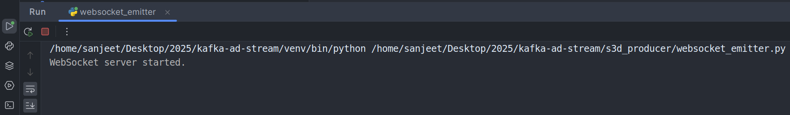

# LiveWire

This module is designed to start generating synthetic logs and send it to websocket ("ws://0.0.0.0:8765"). 
The logs are events triggered from an application and contains information like user_id, event_timestamp, event_name, 
platform, geographical information etc. 

Broadly speaking this module has 4 parts

1. **websocket_emitter.py:** Generate realtime events and continuously sends it to websocket.

2. **websocket_client.py:** Client application reads websocket events and prints it for testing and demonstration.

3. **produce_to_kafka.py:** Kafka producer that pushses these messages to a kafka topic. 

4. **kafka_consumer.py:** Kafka consumer that subscribes to the topic and reads event log and stores it in minio bucket. 


In order to start generating the log, follow below steps.
### In case you are running entire app in a Docker container you need to: 
### Active the virtual Environment

```shell
source /home/kafkauser/environments/kafka_venv/bin/activate
```


### 1. Run the websocket log emitter app:
```shell
python websocket_emitter.py
```
And you will see following message in the terminal


### 2. Run the websocket client to see the logs being emitted by emitter app:
```shell
python websocket_client.py
```
This websocket_client app checks message arriving at "ws://0.0.0.0:8765" 
So you will see that synthetic event log is continuously being served to "ws://0.0.0.0:8765" 


---


> As there are four pyton scripts running as part of this application, you can easily lose track
on which script is running in which window, and this will make it difficult to kill a particular python script. 

**For example:** I ran websocket_emitter, websocket_client, kafka_producer, kafka_consumer. 
And I want to kill websocket_client as that is only for testing purpose. 

**So follow below steps to identify a process and kill it:**

```shell
ps aux | grep "python websocket_client.py"

# You will get a message like below and then you can take PID and kill it
#sanjeet   135259  0.0  0.0  12672  3532 pts/3    R+   02:06   0:00 ps aux
#sanjeet   135260  0.0  0.0   9228  2276 pts/3    S+   02:06   0:00 grep --color=auto python websocket_emitter.py 

kill <PID>

```

```
kafkauser@50181aea5ad7:~/app$ ps aux | grep "python produce_to_kafka.py"
kafkaus+   628 23.0  0.4 601164 32232 pts/0    S    15:26  11:07 python produce_to_kafka.py
kafkaus+ 91428  0.0  0.0   6684  2268 pts/1    S+   16:15   0:00 grep --color=auto python produce_to_kafka.py
kafkauser@50181aea5ad7:~/app$ ps aux | grep "python websocket_emitter.py"
kafkaus+   609  1.8  0.5 406320 41628 pts/0    Sl   15:16   1:04 python websocket_emitter.py
kafkaus+ 94398  0.0  0.0   6688  2244 pts/1    S+   16:15   0:00 grep --color=auto python websocket_emitter.py
```


# More on Kafka Consumer Script

### 1. kafka_consumer_stream.py: Suitable for real-time systems
The kafka consumer script has following features
1. When started it looks for `offset.json` file in Minio Bucket
   - offset json tracks offset for each partition of the topic.
   - The script using threading library to write offset in a parallel thread while consumer is still consuming.
   ```json
      ## offsets = 
      {
       "websocket_s3d-0": 100,  # Partition 0 of topic "websocket_s3d" has offset 100
       "websocket_s3d-1": 200,  # Partition 1 of topic "websocket_s3d" has offset 200
      }
   ```
2. If found it starts reading kafka broker from the offset stored
3. If not found then it start reading messages from beginning
    - What happens when message from beginning are deleted due to expiry of retention policy.
4. Then every 5 minutes it saves the offset to minio bucket in `offest.json` file
5. In case consumer app is terminated in 3 minutes, then on manual termination it saves offset. 
    - Implemented in finally block

### 2. kafka_consumer_batch.py: Suitable for batch jobs
1. There is another version of consumer app that:
2. Starts reading from last offset and reads all message till last minute from start time. 
3. Once it is done consuming it saves offset and quits gracefully. 
